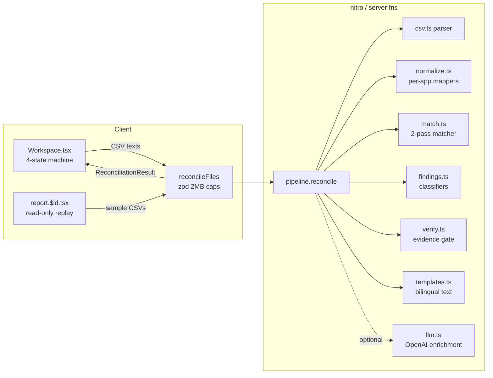

# Hisaab — Architecture

## Overview

Single-page workspace + server-side reconciliation pipeline. No auth, no
database — stateless request/response; the only persistence is the shareable
report URL, which replays the deterministic seed reconciliation.

## Data flow

1. Client reads CSV files (user uploads or `/samples/*`) as text and preserves
   each filename for evidence citations.
2. `reconcileFiles` validates with zod (4 strings capped at 2MB each and
   optional display names capped at 255 characters) and calls `pipeline.reconcile`.
3. Pipeline: parse → normalize → match → classify → verify → summarize →
   ticker → (optional enrich). Output is the frozen UI contract from
   `src/lib/hisaab/types.ts`.
4. Client replays the result: parsing animation (real row counts), ticker over
   `result.ticker` with flags from `result.flagUtrs`, staged missing-money
   counter, then the report.

## Key invariants

- **Deterministic core**: no env keys → full correct result, zero network.
- **Evidence before publication**: `verify.ts` drops any claim whose cited raw
  rows do not contain the claimed amount and UTR.
- **Paise internally, rupees at edges**: integer math only inside the engine.
- **Frozen UI contract**: `Finding`, `Summary`, `TxRow`, `EvidenceRow` shapes
  are shared by engine output and UI rendering; engine-internal types
  (`ReconciliationResult`, `CanonicalTx`) may be extended freely.

## Deploy

Vercel (Nitro Vercel preset, selected by `vercel.json`). `OPENAI_API_KEY` is an
optional env var for the enrichment layer. A keep-alive ping during the judging
window prevents cold starts on the demo path.
